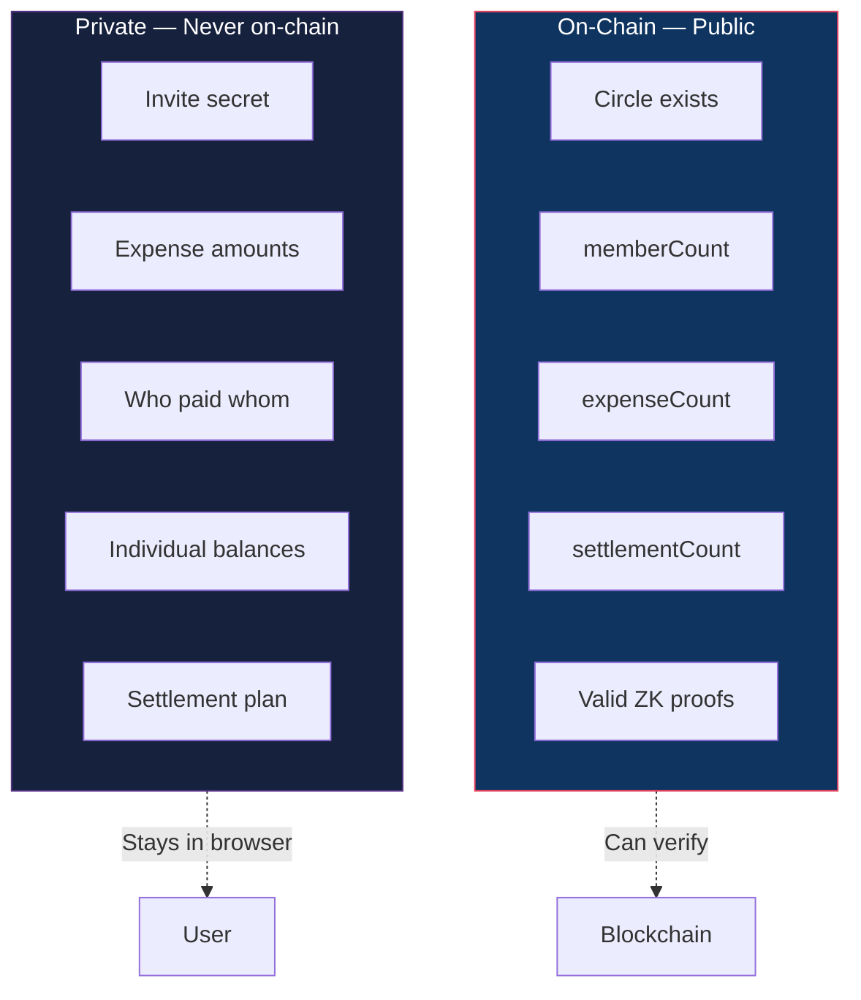
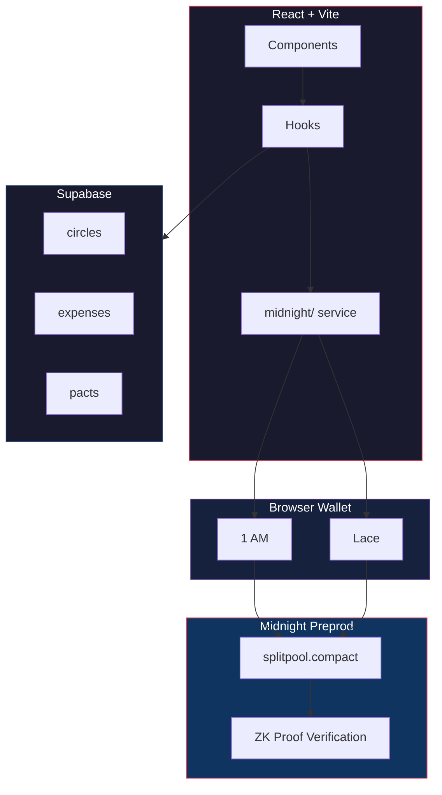

<div align="center">

# Meridian

### Confidential Group Expense Settlement

*Settle with friends, prove it's fair, show strangers nothing.*

<br/>

[](https://github.com/Anubhab-Rakshit/meridian/actions/workflows/ci.yml) [](#test-suite) [](https://midnight.network) []()

<br/>

**[Live Demo](https://meridian-midnight.vercel.app/)** · **[3-Min Video](https://youtu.be/CFae-K52us0)** · **[Architecture](docs/architecture.md)** · **[User Guide](docs/USAGE.md)**

**[@meridian_split](https://x.com/meridian_split)** · [Post 1](https://x.com/meridian_split/status/2101929901075075315?s=20) · [Post 2](https://x.com/meridian_split/status/2101930152150384969?s=20) · [Post 3](https://x.com/meridian_split/status/2101930344828350598?s=20) · [Post 4](https://x.com/meridian_split/status/2101933059205632280?s=20) · [Dev Thread](https://x.com/anubhab_26/status/2101745295541572002?s=20) · [Dev Thread](https://x.com/anubhab_26/status/2101745430455603693?s=20) · [Dev Thread](https://x.com/anubhab_26/status/2100218988907421779?s=20)

**[Feedback Form](https://docs.google.com/forms/d/e/1FAIpQLSeUNNyC7LbEBR1XpLa_VJbyh_Vd7NtndDYDyGkCIhV13SluwA/viewform?usp=sharing&ouid=116630055802177695188)** · **[Responses](https://docs.google.com/spreadsheets/d/1ItI28nL9y5nyUPujuwoDvgprTqZAgJ349ss53LeGsrE/edit?usp=sharing)** · **[Excel Export](docs/feedback-responses.xlsx)**

<br/>

</div>

---

## Screenshots

<div align="center">


*Split expenses. Stay private.*

<br/>


*Your Circles — private vaults synced on Midnight*

<br/>


*Private circles. Real money. Zero exposure.*

</div>

---

## Why Meridian Exists

Every expense-splitting app has the same problem: **your financial data is exposed**.

Splitwise shows everyone's balances. On-chain splitters put every amount on a public ledger. Your spending habits, who you pay, how much — all visible to anyone who looks.

Meridian takes a different approach. Every expense is committed on-chain as a zero-knowledge commitment hash. The amounts, the payers, the balances — none of it touches the blockchain. Only mathematical proofs that everything is correct. An observer can verify the circle is real and the settlement is fair, but can **never** recover a single number.

> "Verify correctness without revealing data." That's the core idea.

---

## How It Works


1. **Create** — Deploy a circle contract. Get an invite secret.
2. **Join** — Friends enter the secret. ZK proof proves they know it. No public member list.
3. **Log** — Expenses are committed as hashes. Amounts stay private.
4. **Settle** — Netting engine computes minimum transfers. ZK proof proves it's zero-sum.

---

## What an Observer Sees vs What Stays Hidden



### The Math Behind It

When you log an expense, the amount is committed as:

$$C = \text{persistentHash}(\texttt{"meridian:v1:secret:"} \parallel \text{secret} \parallel \text{salt})$$

- **Binding**: Can't open $C$ to two different values
- **Hiding**: Can't recover $\text{secret}$ or $\text{salt}$ from $C$
- **256-bit salt**: Brute-force infeasible ($2^{256}$ possibilities)

For the full privacy model, see [docs/privacy-model.md](docs/privacy-model.md).

---

## The Contract

```
━━━━━━━━━━━━━━━━━━━━━━━━━━━━━━━━━━━━━━━━━━━━━━━━━━━━━━━━━━━━━━━━━━━━
 Meridian — splitpool.compact on Midnight Preprod
━━━━━━━━━━━━━━━━━━━━━━━━━━━━━━━━━━━━━━━━━━━━━━━━━━━━━━━━━━━━━━━━━━━━
 Active Contract   : a9206339b84565fd515c0b2a49ae86783c7a7f278ed42414723b1053d489ecb8
 Deployer          : mn_addr_preprod13zlyk4cr9qqygx3h5swk6xl2lk80vv0ut874ze66fhx3xda0umtqdt24za
 Tx Hash           : b76370710fb8cf72d2808a65e1f3ae5da8d4dcd7f264c20a92611bade75c5d56
 Deployed          : Sep 19, 2026
 Explorer          : https://explorer.1am.xyz/contract/a9206339b84565fd515c0b2a49ae86783c7a7f278ed42414723b1053d489ecb8?network=preprod

 Active Circuits   : join | logExpense | settle
 Rules             : Invite-gated membership; expenses as ZK commitments;
                     settlement proves zero-sum without revealing amounts
 Status            : 100% On-Chain Verifiable (Zero Mocking)
━━━━━━━━━━━━━━━━━━━━━━━━━━━━━━━━━━━━━━━━━━━━━━━━━━━━━━━━━━━━━━━━━━━━
```

[View on 1AM Explorer ↗](https://explorer.1am.xyz/contract/a9206339b84565fd515c0b2a49ae86783c7a7f278ed42414723b1053d489ecb8?network=preprod)

### Deployment History (v1 → v3)

| Version | Contract Address | What changed | Explorer |
|---------|------------------|--------------|----------|
| **v3 — active** | `a9206339b84565fd515c0b2a49ae86783c7a7f278ed42414723b1053d489ecb8` | Deterministic salt derivation — fixes the settle circuit (previous versions used a random salt, so the on-chain commitment check failed intermittently); expense commitments on-chain; hardened proving pipeline | [1AM ↗](https://explorer.1am.xyz/contract/a9206339b84565fd515c0b2a49ae86783c7a7f278ed42414723b1053d489ecb8?network=preprod) |
| **v2** | `d603069345cbafabe723511524a0bebd7649c842667dee171522b2fe63fc0e7d` | Expense commitment hashes written on-chain | [1AM ↗](https://explorer.1am.xyz/contract/d603069345cbafabe723511524a0bebd7649c842667dee171522b2fe63fc0e7d?network=preprod) |
| **v1** | `2eff47c41ca88490d61278c27e6942ff4b758ffd4eb3e929e9cd5e0812f7896d` | First Preprod deployment — invite-gated membership, expense logs, minimum-transfer settlement | [1AM ↗](https://explorer.1am.xyz/contract/2eff47c41ca88490d61278c27e6942ff4b758ffd4eb3e929e9cd5e0812f7896d?network=preprod) |

### Challenge Progress

| Level | Requirement | Status |
|-------|------------|--------|
| Level 5 | 50 unique Preprod users | ✅ Completed — 50 wallets by Sep 19 |
| Level 6 | 70 unique Preprod users | ✅ Completed — 70 wallets by Sep 25 |

### Transaction History

Every contract call — deploy, join, log expense, settle — was a separate on-chain transaction. Multiple contract versions were deployed as the code evolved, so transactions map to different addresses.

**48 transactions** on Midnight Preprod — numbered `01`–`48` (rows of five). Each cell shows the abbreviated hash and links to its explorer entry; the full 64-character hash is inside the link URL.

| | | | | |
|:--|:--|:--|:--|:--|
| [01 `f3b9…7ea0` ↗](https://explorer.preprod.midnight.network/transactions/f3b9d2c314dbb8b1e878f43af7037a7d22c0dcf584da52d5452a8e66295a7ea0) | [02 `8d1f…7950` ↗](https://explorer.1am.xyz/tx/8d1fd961376ce65e1647df41cccc52d6716e4ac94f66ad88c8f5c14735de7950?network=preprod) | [03 `2030…0b36` ↗](https://explorer.1am.xyz/tx/20300e1e437fda967b91434def7174c071369b73832bdf983ad993067d710b36?network=preprod) | [04 `8eb0…ce08` ↗](https://explorer.1am.xyz/tx/8eb01b267ce29bb227961657cf1f4fa472e1f34dec0d0437d69b72a4fea0ce08?network=preprod) | [05 `1ad0…18c2` ↗](https://explorer.1am.xyz/tx/1ad04ce4f18b00447fc498ce1348a0e26722815d303353ce4ee02041102018c2?network=preprod) |
| [06 `50d7…25d4` ↗](https://explorer.1am.xyz/tx/50d7068908308ac886fb4d7efd0093f64534e7b44a4beb325636fc4f891b25d4?network=preprod) | [07 `47ff…e73f` ↗](https://explorer.1am.xyz/tx/47ff2e9cf842a3901509641e93b2138195fdd77340909c6295ba9aefc526e73f?network=preprod) | [08 `4a36…b2fd` ↗](https://explorer.1am.xyz/tx/4a369685da78d4e0101d5f880c00987e9b6594bf75b18e7bbdbd373fed70b2fd?network=preprod) | [09 `1f1f…b7eb` ↗](https://explorer.1am.xyz/tx/1f1f78dfe72a5f016443a8fe088fe0244cd2e46172099baccba08baa8220b7eb?network=preprod) | [10 `a829…b242` ↗](https://explorer.1am.xyz/tx/a8294c6643639a5c9cea13ee9d14057791c1258136d05edcccc0314d1318b242?network=preprod) |
| [11 `5559…8864` ↗](https://explorer.1am.xyz/tx/55590bf00725ef16d038f2344c3baafe6b4685fcdb8cc7c47d12834055578864?network=preprod) | [12 `862a…baf8` ↗](https://explorer.1am.xyz/tx/862a21448cf6a9e441975b366ac18ce2c8d2e0d0145ba97c56318492b9c6baf8?network=preprod) | [13 `bf7a…355e` ↗](https://explorer.1am.xyz/tx/bf7aedb93faf4213dfac56d11923e930480a7349e04eb8250a6d8b7cc815355e?network=preprod) | [14 `a9a2…9481` ↗](https://explorer.1am.xyz/tx/a9a2b3d2c3f8460ec9aa471969625ad5b4bc367c439307f912d1b7b51cf39481?network=preprod) | [15 `3d5d…6be4` ↗](https://explorer.1am.xyz/tx/3d5d2707255e87849efa237f53a39261a87c7ed79168ea7b128502daeed66be4?network=preprod) |
| [16 `405e…da9c` ↗](https://explorer.1am.xyz/tx/405e93dad07330efc5c8662c2c1ad208a986cd79b0dee4f4c5f57cdd4c42da9c?network=preprod) | [17 `0607…48a4` ↗](https://explorer.1am.xyz/tx/0607648026628278f9afdd23ca0f300d54e6392c13b3031643ebf0e8a14648a4?network=preprod) | [18 `dc69…ae88` ↗](https://explorer.1am.xyz/tx/dc69f65c4c876cbe5c9abba571a20db3d365207239b158feab922c95cd8bae88?network=preprod) | [19 `316d…df54` ↗](https://explorer.1am.xyz/tx/316dc8b390cb8e030be6c608955978340e6ed0cd8cfc77400e0acff47bffdf54?network=preprod) | [20 `7778…69a9` ↗](https://explorer.1am.xyz/tx/777802f2874e5c0ef5bc266551a62a47bf4092103f2ff177cee5ea6c06f469a9?network=preprod) |
| [21 `1b67…dd26` ↗](https://explorer.1am.xyz/tx/1b673997b84384a9fbf1dfb58284aff0b80cc3d89842822a67279414388fdd26?network=preprod) | [22 `a7c8…5750` ↗](https://explorer.1am.xyz/tx/a7c8bded59201a3f8659cd8e1fccdf75be2df31171fa999e02b8e7fa83705750?network=preprod) | [23 `27a1…fb20` ↗](https://explorer.1am.xyz/tx/27a12788eb133cb5d748222665a4d6ad3447714d12494fa55998a8e81cfdfb20?network=preprod) | [24 `6806…5c3e` ↗](https://explorer.1am.xyz/tx/6806fbd62a59527a5dc685030379bef5d485642c7a0855dc2dc06f379dd55c3e?network=preprod) | [25 `50f9…eec2` ↗](https://explorer.1am.xyz/tx/50f918c461117101465a2a19c66973c842b791ce0d74aa4c2b06a87691f1eec2?network=preprod) |
| [26 `a5d6…8c1d` ↗](https://explorer.1am.xyz/tx/a5d6522b33629886336c5ece16d22c143fafea0fda9a9a5a1b6b15c66a758c1d?network=preprod) | [27 `0a3a…18a5` ↗](https://explorer.1am.xyz/tx/0a3abd9b481cd072c55219d3dbbdc6ff47999fe25075f4f6646a9b08e91c18a5?network=preprod) | [28 `44f4…4703` ↗](https://explorer.1am.xyz/tx/44f41b349ee2a50fa672125635d4478b000893a1422b616b15eaf0e435994703?network=preprod) | [29 `ad32…333a` ↗](https://explorer.1am.xyz/tx/ad32274c03205eb204aedbbed0ebed277dcb06a732f1bbc456779358a6d8333a?network=preprod) | [30 `9269…02af` ↗](https://explorer.1am.xyz/tx/9269e2a07f70d459aa32a324030e6f14dc03678267bf811e4ac2d67f1d0f02af?network=preprod) |
| [31 `ddb9…0533` ↗](https://explorer.1am.xyz/tx/ddb9b50082ab90313538782b098fa6479f0eca6d613a61ff43c8edf820680533?network=preprod) | [32 `7fd3…dcd5` ↗](https://explorer.1am.xyz/tx/7fd308fb4163ab8d2338f1cdaf659c64f3e87aa48aa54906224a93a0ff0bdcd5?network=preprod) | [33 `440f…07f5` ↗](https://explorer.1am.xyz/tx/440f633302237346234b1b0b33242cc7c0efd7fad28af5f0e98f5885512707f5?network=preprod) | [34 `43aa…d316` ↗](https://explorer.1am.xyz/tx/43aa0a22059fcbe7b2df9aab65311bc91efe4d8bed4ab025a03bf6217ea3d316?network=preprod) | [35 `3801…a4cd` ↗](https://explorer.1am.xyz/tx/3801a1ba31ba2c931818bd6b429d7ca3a447acb9cfa782ffd8d54125e4d2a4cd?network=preprod) |
| [36 `8dd7…e78a` ↗](https://explorer.1am.xyz/tx/8dd7006e24da41411f8a76b9056d39e69c40a6fc2501a4caa17f0c78a16ae78a?network=preprod) | [37 `4b0e…db56` ↗](https://explorer.1am.xyz/tx/4b0e9de2c9c5f3bd984b5fc207bc8931e9f160b029bce72be3dee91e7799db56?network=preprod) | [38 `81dd…c52c` ↗](https://explorer.1am.xyz/tx/81ddfac1b56b7f1a78809f756aa5cc8b5ccffdca3e3aa265098a888e1c12c52c?network=preprod) | [39 `99df…138b` ↗](https://explorer.1am.xyz/tx/99df104ed1e5517443b10fa2eb3e4e9006426b07dc94c3e61d0f2682d468138b?network=preprod) | [40 `120e…7bfd` ↗](https://explorer.1am.xyz/tx/120ed0b71da7f079cb8eaece4b18af9a2f7bbd4e23330ae3dfab444898437bfd?network=preprod) |
| [41 `cca5…68ba` ↗](https://explorer.1am.xyz/tx/cca57e4469b59d18b39bcc85c42c0fc0da1209f720a92bbcbaecdff2ae9368ba?network=preprod) | [42 `d11f…973f` ↗](https://explorer.1am.xyz/tx/d11f625ac3d6be4621187a7549944b01aafe62a971f5b4a5bd3a01abb283973f?network=preprod) | [43 `a24f…6fcc` ↗](https://explorer.1am.xyz/tx/a24faa5d0cf452414822c6ef156f5331ba7789612502893709a947e2117a6fcc?network=preprod) | [44 `798c…0a91` ↗](https://explorer.1am.xyz/tx/798c8b3aeb45d360fc1c6a1d4025276f4a223c8d8a5b62f66061f7e772e90a91?network=preprod) | [45 `a9ce…27bc` ↗](https://explorer.1am.xyz/tx/a9cecd4b84c833e730260481ba6d8e67d911fd6d6536bb97b713129a530427bc?network=preprod) |
| [46 `d065…fb7c` ↗](https://explorer.1am.xyz/tx/d065da263843b3caeb1db5d03bee9b36eec5952b42faebfbdea5e402def4fb7c?network=preprod) | [47 `bb03…5b28` ↗](https://explorer.1am.xyz/tx/bb03a715ecded16e58812942c06f98813f5eb540bac112b6d37a902e0c825b28?network=preprod) | [48 `1339…38e1` ↗](https://explorer.1am.xyz/tx/133907b87aee0282b1838fcdc8a2acedf2acaac819b61902c67cb379b13738e1?network=preprod) |  |  | |

> Contracts were redeployed as the codebase evolved (v1 → v2 → v3), so these transactions span multiple contract addresses. The final settle tx (`55590bf...`) is on the active v3 contract.

### Improvement Summary (Based on Feedback)

Feedback collected through the Google Form drove these changes. Every shipped item links to its git commit.

**Shipped**

| # | What users reported | What we did | Commit |
|---|---------------------|-------------|--------|
| 1 | Settling never cleared balances — expenses stayed open forever | Settlement now **closes the round**: expenses marked settled, on-chain plan hash recorded, balances reset to zero, RLS `UPDATE` policy added (`005`/`006`), closed rows tagged ✓ SETTLED | [bbc22ae](https://github.com/Anubhab-Rakshit/meridian/commit/bbc22ae), [57179a4](https://github.com/Anubhab-Rakshit/meridian/commit/57179a4) |
| 2 | Settlement proving failed for visitors of the hosted app | Browser proving routed through the local proof server (`VITE_PROOF_SERVER_URL`) | [57179a4](https://github.com/Anubhab-Rakshit/meridian/commit/57179a4) |
| 3 | Stale wallet/local state caused failed or odd contract calls | Stale localStorage cleared before every contract call | [dfa8f29](https://github.com/Anubhab-Rakshit/meridian/commit/dfa8f29) |
| 4 | Wallet disconnect showed raw errors | Lace `RemoteApiShutdownError` detected → friendly reconnect message | [e9de265](https://github.com/Anubhab-Rakshit/meridian/commit/e9de265) |
| 5 | Mobile layout broken (nav pills, connect button, spacing) | Responsive nav, corrected offsets, sized connect button for small screens | [afa1f90](https://github.com/Anubhab-Rakshit/meridian/commit/afa1f90) |
| 6 | New users asked for step-by-step usage instructions | Non-technical user guide (`docs/USAGE.md`) linked from README | [d801b1d](https://github.com/Anubhab-Rakshit/meridian/commit/d801b1d) |
| 7 | Double-tap on action buttons could submit twice | Primary buttons disable while a transaction is pending | [e68fa90](https://github.com/Anubhab-Rakshit/meridian/commit/e68fa90) |
| 8 | Wallet connection lost on page refresh (8 reports) | Wallet session persisted and silently restored on every load | [351bb07](https://github.com/Anubhab-Rakshit/meridian/commit/351bb07) |
| 9 | Mobile toasts stuck / blocking inputs (2 reports) | Toasts dismissible, pending auto-times-out, full-width top placement on mobile | [d6d4942](https://github.com/Anubhab-Rakshit/meridian/commit/d6d4942) |
| 10 | Balance does not update (1 report) | Wallet balance auto-refreshes every 30s and on window focus | [1ffeb98](https://github.com/Anubhab-Rakshit/meridian/commit/1ffeb98) |
| 11 | Custom splits still "coming soon" (3 reports) | Per-member percentage splits — honored in balances, settlement plan and cards | [c2d812b](https://github.com/Anubhab-Rakshit/meridian/commit/c2d812b) |
| 12 | Footer links were demo placeholders; footer too thin (2 reports) | Real repo / demo / X / user-guide / architecture / feedback / video links + Resources column | [1a87f25](https://github.com/Anubhab-Rakshit/meridian/commit/1a87f25) |
| 13 | No one-click copy of vault contract address (2 reports) | Copy buttons in circle header, invite panel and circle cards | [1a87f25](https://github.com/Anubhab-Rakshit/meridian/commit/1a87f25) |
| 14 | Double-tap could fire a contract call twice | Re-entrancy guards on deploy / join / settle handlers | [1a87f25](https://github.com/Anubhab-Rakshit/meridian/commit/1a87f25) |
| 15 | Custom cursor hid or inverted text underneath | `pointer-events` locked off, blend inversion removed, hidden until the mouse moves | [1a87f25](https://github.com/Anubhab-Rakshit/meridian/commit/1a87f25) |
| 16 | Dashboard layout glitches on phones | Circle dashboard collapses to one column; header, tabs and card grids reflow without overflow | [2c3738a](https://github.com/Anubhab-Rakshit/meridian/commit/2c3738a) |
| 17 | About page too long for mobile | Copy trimmed; compact paddings and single-column restructure under 640px | [2c3738a](https://github.com/Anubhab-Rakshit/meridian/commit/2c3738a) |
| 18 | SVGs looked AI-generated | 16 bespoke SVGs replaced with the app's consistent lucide icon set; unused template assets removed | [3363ad6](https://github.com/Anubhab-Rakshit/meridian/commit/3363ad6) |

**Round 2 (Sep 28–30) — status**

- **Shipped this iteration (rows 8–18):** wallet session restore, mobile-safe toasts, balance auto-refresh, custom splits, real footer links, contract-address copy buttons, double-submit guards, cursor fix, mobile dashboard layout, About-page trim, SVG replacement — 7 commits: [`351bb07`](https://github.com/Anubhab-Rakshit/meridian/commit/351bb07), [`d6d4942`](https://github.com/Anubhab-Rakshit/meridian/commit/d6d4942), [`1ffeb98`](https://github.com/Anubhab-Rakshit/meridian/commit/1ffeb98), [`c2d812b`](https://github.com/Anubhab-Rakshit/meridian/commit/c2d812b), [`1a87f25`](https://github.com/Anubhab-Rakshit/meridian/commit/1a87f25), [`2c3738a`](https://github.com/Anubhab-Rakshit/meridian/commit/2c3738a), [`3363ad6`](https://github.com/Anubhab-Rakshit/meridian/commit/3363ad6).
- **Still planned:** wallet modal redesign (3 reports), profile page (3), dark/light mode (2) — tracked in [`docs/FEEDBACK.md`](docs/FEEDBACK.md).

Full analysis: [`docs/FEEDBACK.md`](docs/FEEDBACK.md)

---

## Users Onboarded & Feedback

All **70 unique Preprod users**, their wallets, and what they told us. Level 5 requires 50+; Level 6 requires 70 — both met.

*Overview: feedback was collected from all 70 users in Round 1 (Sep 17–25, 2026). Everything in this section — stats, tables, summaries — is from Round 2 (Sep 28–30, 2026).*

> **[Google Form](https://docs.google.com/forms/d/e/1FAIpQLSeUNNyC7LbEBR1XpLa_VJbyh_Vd7NtndDYDyGkCIhV13SluwA/viewform?usp=sharing&ouid=116630055802177695188)** · **[Google Sheet](https://docs.google.com/spreadsheets/d/1ItI28nL9y5nyUPujuwoDvgprTqZAgJ349ss53LeGsrE/edit?usp=sharing)** · **[Excel Export](docs/feedback-responses.xlsx)** · **[Feedback analysis](docs/FEEDBACK.md)** · **[Wallet verification](docs/PREPROD_WALLETS.md)**

| Metric | Value |
|--------|-------|
| Unique Preprod users | 70 |
| Feedback responses (Round 2) | 70 (Sep 28 – Sep 30, 2026) |
| Liked the product | 70 / 70 (100%) |
| Average rating | **9.03 / 10** |
| Would recommend | 65 yes · 2 maybe · 3 blank |
| All wallets on Midnight Preprod | ✅ verified via [1AM Explorer](https://explorer.1am.xyz) |

### Users Onboarded (70)

| User ID | Name | Email | Wallet Address | Feedback Summary |
|---------|------|-------|----------------|------------------|
| U01 | Aritra Sarkar | sarkararitra505@gmail.com | `mn_addr_preprod1wg8gaqrqn8yn958lpsarh6meslfepr86cd5em6k6y7rqrvpa9eeqcvr379` | 6/10 · No issues reported |
| U02 | Taniya Singh | taniyas071@gmail.com | `mn_addr_preprod19vexpfkvl6qvd427de72pkd34m5lny3clkyqvnyhkfmfun34m4qscnvkfw` | 9/10 · Suggests: make the svgs more better , some felt like ai |
| U03 | Koyeli Kundu | kundukoyeli645@gmail.com | `mn_addr_preprod1snhk2eyw67t3vs657uu5g0v6pws4u37uktl5uj3jj2ls5ftac3aqwyluep` | 10/10 · Liked: The design |
| U04 | Sreejita Basu | basusree06@gmail.com | `mn_addr_preprod164fh96sxtwla2jncujgu3avrsgw5zg72q6m6v23uqk3s00fynxzsrc20y6` | 8/10 · Liked: navbar is quite good and wallet connection… |
| U05 | Subham Bhat | subhambhat2005@gmail.com | `mn_addr_preprod15ggp8x65pvkx8z3ek2xd26ryqtulsk3mc4zt3cank3svzyf2z3es6jru3d` | 8/10 · Liked: Animations |
| U06 | Snigdhanil Basu | snigcomxii@gmail.com | `mn_addr_preprod1a4n6rqulslhf59j24salg9dejqtfg8xymcg9xssjv59r8zr94x2spt3pug` | 10/10 · No issues reported |
| U07 | Maitri Golder | maitrigolder0@gmail.com | `mn_addr_preprod1frcdh490mryjpy4ef55mxhl7mlx6s0g2j9qz5pv6y49rkxx7vcvsgn3dak` | 8/10 · No issues reported |
| U08 | Amitava Pal | dolapal028@gmail.com | `mn_addr_preprod1nyd6v9futt9v3vpvkn07apyd7fl8s884d2edscxef3taexneegmqdfmn6e` | 8/10 · Bug: Notification cannot be removed in mobile display ,… · Suggests: Improve the bug that i have suggested |
| U09 | Moumita Rakshit | moumitarakshit.0907@gmail.com | `mn_addr_preprod1tdxl2uvfca30mqsnu3z8g7sdr20xkc7mpd2yuc7384suuftfllaszm54fh` | 9/10 · No issues reported |
| U10 | Shreyak Mitra | shreyakmitra1729@gmail.com | `mn_addr_preprod1h86qpnzmy4ep8zf3mu2dpg7u5apxhsskwl83znk5tweqq4uucguq4tyu9h` | 10/10 · Bug: Wallet connection loses on refreshing · Suggests: Its a splitting app that i got to know after… |
| U11 | Aabes Sarkar | aabessarkar@gmail.com | `mn_addr_preprod13rs8z572up7qw25j2xslmew88jxf3k2h5wsrwp07w3fh88yemgvq887jjg` | 9/10 · No issues reported |
| U12 | Sreeja Ray | sreejaray2004@gmail.com | `mn_addr_preprod1h7s7wcx6fdyk54elnapyuz8m7hys2r7m9cjs6wlp7de0rvwk25hqt5vzkk` | 10/10 · Liked: the settlement , analytics , dashboard |
| U13 | Praloy Sahoo | praloysahoo2019@gmail.com | `mn_addr_preprod17xc9vdngf2tfjfy3h52j900qmacsvrxnxp4legs5xjpnrvq62y3s7ychak` | 10/10 · No issues reported |
| U14 | Ruparna Biswas | ruparnabiswas1@gmail.com | `mn_addr_preprod14erua8cg5zrjdg5g2lwasau9er87hrra95884xgypy5s0ldsrdsq7uvdnr` | 9/10 · No issues reported |
| U15 | Tamisra Moitra | tamimoitra2129@gmail.com | `mn_addr_preprod1k62wdw7fycndqjgy533cazu5qfxhqvtv0fmqgq5gadc7qn6s4xtswuzdhu` | 10/10 · Liked: very good work bro , the design is very… |
| U16 | Antara Bhattacharjee | antarabhatta34@gmail.com | `mn_addr_preprod1nd9q3armke7gcqtld73a2wlkffmehj0agf4gnytnwp7n7ml8ad3qdx2l7x` | 6/10 · Bug: After wallet connection , circles tab is not loading , it… |
| U17 | Sohana Ghosh | sohanaghosh1@gmail.com | `mn_addr_preprod1ltmj8urdpevp3zdpax5c80lnlc2e83xs3dqgftqjv2ulfnq0nj4qgvuuz3` | 10/10 · No issues reported |
| U18 | Rooplekha Banik | rooplekhabanik7879@gmail.com | `mn_addr_preprod1kvq2egk76h9v2pc8upyh5dpklt30my7guyks0h3qajul6hzk47csq2gc9r` | 9/10 · Bug: In invite , we need the contract address , it could be… |
| U19 | Sankhanil Chanda | sankhanilchanda@gmail.com | `mn_addr_preprod1523chzum0jyelcv8f35yp2ua74gje87yztxdruq4cyuvltp7fwls3ex8vj` | 9/10 · Bug: some layout issues in mobile in the dashboard · Suggests: fix the bug , nothing else than that |
| U20 | Prajit Bakshi | prajit.bakshi@gmail.com | `mn_addr_preprod1p874ecyu2ygkq6pmk8j9ug0gx256kt3kgug6chcmkn0s4kpxnt0qjh8awj` | 10/10 · No issues reported |
| U21 | Tathagata Ghosh | hit.ttgt@gmail.com | `mn_addr_preprod1k9x28wd2nt5ptz08xvw46ugwnau2crp8mz8rwv6shggdp4e44cfsucdnu8` | 10/10 · Suggests: work on the UI i would recommend |
| U22 | Mourya Saha | mourya.saha.2004@gmail.com | `mn_addr_preprod1pag8u6a52f3ncjaxge5jgpx0cs2sd2c2h3hs99ydzy2cuxjmnfjsllnsla` | 10/10 · Liked: very good use of the blockchain network |
| U23 | Upasana Aditya | upasanaaditya1@gmail.com | `mn_addr_preprod1hkcqv6xhmxkqnzg5m0zjxfg9ynq2r2sfdse3c5yeacr8rs6zwn8q6300va` | 9/10 · Liked: the footer design |
| U24 | Avishikta Bagchi | bagchi.avishikta@gmail.com | `mn_addr_preprod1v3rr5v9gqxkp6twzvlq0l85zsu8pvnmar57l2c4jyn8ulql4aaxq2nzz5y` | 9/10 · Bug: Wallet connection issue at first · Suggests: Make the wallet modal better |
| U25 | Amit Rakshit | surabhi.amitsili@gmail.com | `mn_addr_preprod1334m6h9j54rq8l4xpumnl52349r7s93p4w2juac2erf4h55cqnyqpxspy4` | 9/10 · No issues reported |
| U26 | Subrata Rakshit | subratarakshit.1964@gmail.com | `mn_addr_preprod1c9ev6we5d8a9rgyeke9gceqwk0fgadglnh53vw4dd2d250skyt8qj26ssk` | 10/10 · Liked: experience |
| U27 | Ayush Sarkar | ayushsarkar19@gmail.com | `mn_addr_preprod1jyylr9cr7534npedze6n7du7wh2ne3g0p8navm3yvkkuytmpx38s8u2ngd` | 6/10 · Suggests: make it simple for common guys |
| U28 | Saketh Ram | thammandrasr@iitbhilai.ac.in | `mn_addr_preprod1ss0hew4qhwaksjmagm74q8ts9daqdj4enkckwgrlrc683cl0psts3mhm3t` | 10/10 · No issues reported |
| U29 | Susmita Rakshit | susmitarakshit.2010@gmail.com | `mn_addr_preprod1wnn3val5lak6x6kxrkgm4d6lg4cwxh9q4jdmvmsqang38zutdwpqdg84fj` | 10/10 · No issues reported |
| U30 | Subham Neogi | subhamneogiju@gmail.com | `mn_addr_preprod1d8e3pnwuag82vutdhzuejkh3ywm7hxurz65th9exc24lua7ks86stsd75j` | 10/10 · Suggests: improve the modal box for wallet connection |
| U31 | Sayon Sarkar | sayonsarkar342@gmail.com | `mn_addr_preprod16q7axcpjz6xec30xgqk7vfe2mf2mr0nsp23pfyz65rj0lx5jcmtsghp55w` | 8/10 · Liked: the pacts idea |
| U32 | Mukta Das | dmukta518@gmail.com | `mn_addr_preprod1f66zgjvpmnh5arwl94fplymyjpe2ztljmlyh5mp5m9yjncyd5v4qgwkjmp` | 8/10 · Suggests: the buttons/links in the footer are demo , you… |
| U33 | Rasa Majumdar | rasamajumdar28@gmail.com | `mn_addr_preprod1v6662a3jtlg837znw6dqexy7rmnw82d92y399nsdfj4amz0tjwsqdx3cr2` | 8/10 · Bug: notification issue in mobile · Suggests: improve the notification feature |
| U34 | Sampad De | sampad1325@gmail.com | `mn_addr_preprod1c4dle6ystrg2fzqllrznsd2axxs8wzatskra99nfdjj7056snkps5j99rk` | 8/10 · Liked: Frontend is superb bro , keep up the good… |
| U35 | Adrish Karak | adrishkarak@gmail.com | `mn_addr_preprod17h5afvjuxth0ll9fwwxghset70yvjmdsy4r73ylgyktdaugspfasg39zc8` | 9/10 · Bug: wallet connection has some bugs |
| U36 | Sayanaditya Das | sayanaditya.83719@gmail.com | `mn_addr_preprod12sgn0utygaq4wpcq5tp6pkwsxhv8g7vqcc23wx2z70wvl8cvg7asvpkt8v` | 9/10 · Liked: most of them like expenses logs , private… |
| U37 | Anisha Ghosh | ghoshanisha421@gmail.com | `mn_addr_preprod1690euzgz8a9sed7vwly6ms5ggjfs0kv0qxm3nkh4g4xalyt24apq9d6sn5` | 10/10 · Liked: Fluidity of the UI and smooth features |
| U38 | Sarin Sanyal | tufan03125@gmail.com | `mn_addr_preprod10ycpshvqn7hpec5tv0nyyj2w7fggtcjg6fke5glrmh23f5fauqfqr87mst` | 9/10 · Liked: settlment |
| U39 | Srijit Das | srijitd248@gmail.com | `mn_addr_preprod1mps8d2g4l0zzfylxtvtlrelcv0xf9rjlrrgzskj4elewkx444wnqls3pvs` | 9/10 · Suggests: make a good wallet modal box , the current modal… |
| U40 | Sanbartika Ghosh | sanbartikaghosh15@gmail.com | `mn_addr_preprod1asdehuvhzmmevdvvt9p4dd4uyzudy05rwu9zjq048qzm97ka9qds7t4xez` | 10/10 · No issues reported |
| U41 | Soumili Das | soumilidasslg@gmail.com | `mn_addr_preprod1r8lf8m44mfyl5y827pzw6mjsws2mu0df5uezcnwe46jdj6z2tvxqa4qj8h` | 10/10 · No issues reported |
| U42 | Snigdha | snigdhapaul@gmail.com | `mn_addr_preprod10s27qn6q9htq085xkjfv5ee0l0vrwvvngz333epnxcd6kxh9az4qklqtx8` | 8/10 · Suggests: contract under vault could have a copy option ,… |
| U43 | Gargi Saha | gargisaha2006@gmail.com | `mn_addr_preprod126plssmyfh2ene5z4p6820fs82h5l3earkt8z4gq4v90wvkxlg0s78ggk2` | 9/10 · Liked: All of them |
| U44 | Pooja Das | naamkyujannahaibhai@gmail.com | `mn_addr_preprod1kz86ktz9j5ckalqcsa0825ldcc5j9vkdr08tc24hvdtln7c8upss0m849p` | 9/10 · Bug: yes some like in wallet connection , expense logging |
| U45 | Raja | anubhabteashop@gmail.com | `mn_addr_preprod1c0sez6fqfv2g7km4gw6hva9xtkqyxnurnc5enxn7avcrcvmldafquth68e` | 7/10 · Bug: sometimes cursor hides the text under it |
| U46 | Kausheya Roy | royrimo2006@gmail.com | `mn_addr_preprod1fnwnmmgsdk6zg782fhdqj8wn0ndluaqcxad2tuweectecz0uaf8sg0lq0n` | 8/10 · Suggests: dark/light mode and settlements have some problem |
| U47 | Shreyasi Paul | shreyasipaul02@gmail.com | `mn_addr_preprod10squhl6rdvyyfajdxpsjdzqfk3sqvpqrxem2au0ukc8guafjqurshk6llw` | 10/10 · No issues reported |
| U48 | Debasmit Bose | debasmitbos22@gmail.com | `mn_addr_preprod1zzfgchs7qaenazw93l8vrd6e53l7txpsmhmkm7a2g907xuqf47dqmfkt2f` | 10/10 · Suggests: on clicking buttons 2 times , 2 times contract… |
| U49 | Rick Acharjee | acharjeerick77@gmail.com | `mn_addr_preprod1ehm6s3e6x5xecur5t9pvwjwxn65unhduj0jcl3qu74y7q39j320qlsx39c` | 10/10 · No issues reported |
| U50 | Nobojit Mondal | nobojitmondal418@gmail.com | `mn_addr_preprod1gkchxaajreqedepx2m9jheqkxxcj7dkx5ka35d9f72kj9k9xzx0smuy3s4` | 9/10 · Bug: balance does not update , hard to refresh , look into it |
| U51 | Rupam Ghosh | rupamgh32@gmail.com | `mn_addr_preprod140wauv4fws3xr46qxgssacdhjkfrxuvjv95kmcv08fpf67ft7zes7r6x57` | 9/10 · Bug: Wallet disconnects on page refresh or re rendering |
| U52 | Arin Das | iamarindas@gmail.com | `mn_addr_preprod18jqnldwdhdxk6haaha707mcrmhvpc5f4pznpt3xx44d2n2y8jassalkjgr` | 10/10 · Liked: The split part |
| U53 | Debanjali Chatterjee | debanjalich9@gmail.com | `mn_addr_preprod1cxx2qszmxgf96gcld2qnt84vaeumn238hma82e59y9jj7gjc8p8sap5d4f` | 10/10 · Bug: no but settlements having an issue · Suggests: footer can be bit detailed |
| U54 | Shreya Dey Sarkar | shreyadeysarkar2008@gmail.com | `mn_addr_preprod1ak6pgcd7rt3ndutvj4njg6jjlhlt4v747sqkrtjdkzgm24y7cxlsn7sdkz` | 8/10 · Liked: the aesthetic design and also the proper… |
| U55 | Soumyajit Mazumdar | soumyajit.mazumder2005@gmail.com | `mn_addr_preprod122w38gq0wfzvnrd757zej6vy5nryjr54ku3yfk2skl6q492n7frq06u9sf` | 10/10 · Suggests: Some more cool features |
| U56 | Sayantika Haldar | sayantikahalder442@gmail.com | `mn_addr_preprod13r0erl7jhefqtkjreqsym7jxstfdqxhy80lyh2u2zacytz4stgqs6c9thg` | 8/10 · No issues reported |
| U57 | Supratik Paul | supratikpaul636@gmail.com | `mn_addr_preprod100nqstdv9p0capdljmcvtpud95wls8w35rvg5exsc4uuluu0qg9slt57xa` | 8/10 · Liked: cool background |
| U58 | Subom Paul | subompaul9@gmail.com | `mn_addr_preprod1gkkyay25ec4h4mhu8rdqrqd428683d63tkx0pmetnprcdurp4fysgrtx5t` | 8/10 · Bug: settlements are having issues · Suggests: a profile page for users could have been done |
| U59 | Srinjoy Mukherjee | srinjoymukherjee2005@gmail.com | `mn_addr_preprod1ad0xaqn06t442zl8fzywmlz6te25wedwpx26zd47fgzcy2jrac6q6qrjf6` | 7/10 · Bug: Wallet connection error in mobile |
| U60 | Ruhani Chakrabarti | chakrabartiruhani@gmail.com | `mn_addr_preprod1t73zluhyn0mtzu2ayugwea4hkxczyrfkf75f7spxhrwpwylpy70qx8awua` | 10/10 · Liked: fonts and design |
| U61 | Oyshee Ghosh | oyshee.ghosh05@gmail.com | `mn_addr_preprod1d072uk080ngt9wncx3hcp5fjg762wq5s7fyy577fhkfcg4g95lds8yppq4` | 10/10 · Liked: the cursor and the fluid navbar , looks… |
| U62 | Vibhan Dutta | bivandatta07@gmail.com | `mn_addr_preprod15kx769kwfaw7yarf24s5l6kjlzpn7ylcvta54dmwmwphwrtdkurq97cgr4` | 9/10 · Suggests: bring custom shares , it is showing coming soon` |
| U63 | Mithu Rakshit | mithurakshit.2612@gmail.com | `mn_addr_preprod19x6kmaj86rmntwg5ekdueytzpghwltxedgcvljvc4gpjcnxfmqzqsseh2r` | 10/10 · No issues reported |
| U64 | Anushka Sarkar | anushkasarkar792@gmail.com | `mn_addr_preprod1sggslvd05fqdtkur6kz84vld3h3pexp232enl9u9l6jnyh4zseeqr6r3v7` | 8/10 · Suggests: improve the about us , its too long and doesn't… |
| U65 | Ananya Basu | basua.slg@gmail.com | `mn_addr_preprod1nh9wy5d8224s9gymfrukwc887txdg78z5jyvawr45qqmwfj699ls42qp2q` | 9/10 · Liked: The transitions and the footer design |
| U66 | Suniska Dey | suniskadey2406@gmail.com | `mn_addr_preprod1nus525thcpwhcmyss8mmeaqhc440ua2c9jkmdvsyrdjg9d62hu7qs9xasg` | 10/10 · Liked: It was quite interesting. |
| U67 | Pradipto Haldar | haldermousumi077@gmail.com | `mn_addr_preprod1c32lg5rkrlmda2s5aknwcarshzsrrx0pry8pm7mvhuc7dg0hln0syd8rg7` | 10/10 · No issues reported |
| U68 | Reet Banerjee | reetbanerjee7829@gmail.com | `mn_addr_preprod1jmdpww7nz7ce8lqt38q3hukwxtgtksfspe9heq9a34meemd67wqqfh7289` | 10/10 · No issues reported |
| U69 | Bodhisatwa Dutta | bodhisatwadutta025@gmail.com | `mn_addr_preprod16qtu7l4lgx8hcw5em5tjq75yq59dyra3cd8memr7cfgv7lz7506q52f4jd` | 9/10 · Bug: Sometimes after loading wallet , it still doesn't allow… |
| U70 | Ayanika Sen | ayanikasen18@gmail.com | `mn_addr_preprod1ffjf0ng49x6k3wx27gnvn5qkz8xns55r8y5394288s8rmpu5dq5shvkxcz` | 10/10 · Liked: how did you make this user interface , its… |

### Feedback Implementation (70)

Each user's feedback mapped to the improvement made, with the corresponding git commit.

| User ID | Name | Email | Wallet Address | Feedback Summary | Improvement Made | Git Commit ID |
|---|---|---|---|---|---|---|
| U01 | Aritra Sarkar | sarkararitra505@gmail.com | `mn_addr_preprod1wg8gaqrqn8yn958lpsarh6meslfepr86cd5em6k6y7rqrvpa9eeqcvr379` | 6/10 · No issues reported | No issues reported — benefited from settlement + wallet + mobile polish ([bbc22ae](https://github.com/Anubhab-Rakshit/meridian/commit/bbc22ae)) | bbc22ae |
| U02 | Taniya Singh | taniyas071@gmail.com | `mn_addr_preprod19vexpfkvl6qvd427de72pkd34m5lny3clkyqvnyhkfmfun34m4qscnvkfw` | 9/10 · Suggests: make the svgs more better , some felt like ai | Replaced 16 bespoke "AI-looking" SVGs with the app's consistent lucide icon set and removed unused template assets ([3363ad6](https://github.com/Anubhab-Rakshit/meridian/commit/3363ad6)) | 3363ad6 |
| U03 | Koyeli Kundu | kundukoyeli645@gmail.com | `mn_addr_preprod1snhk2eyw67t3vs657uu5g0v6pws4u37uktl5uj3jj2ls5ftac3aqwyluep` | 10/10 · Liked: The design | No issues reported — benefited from settlement + wallet + mobile polish ([bbc22ae](https://github.com/Anubhab-Rakshit/meridian/commit/bbc22ae)) | bbc22ae |
| U04 | Sreejita Basu | basusree06@gmail.com | `mn_addr_preprod164fh96sxtwla2jncujgu3avrsgw5zg72q6m6v23uqk3s00fynxzsrc20y6` | 8/10 · Liked: navbar is quite good and wallet connection… | No issues reported — benefited from settlement + wallet + mobile polish ([bbc22ae](https://github.com/Anubhab-Rakshit/meridian/commit/bbc22ae)) | bbc22ae |
| U05 | Subham Bhat | subhambhat2005@gmail.com | `mn_addr_preprod15ggp8x65pvkx8z3ek2xd26ryqtulsk3mc4zt3cank3svzyf2z3es6jru3d` | 8/10 · Liked: Animations | No issues reported — benefited from settlement + wallet + mobile polish ([bbc22ae](https://github.com/Anubhab-Rakshit/meridian/commit/bbc22ae)) | bbc22ae |
| U06 | Snigdhanil Basu | snigcomxii@gmail.com | `mn_addr_preprod1a4n6rqulslhf59j24salg9dejqtfg8xymcg9xssjv59r8zr94x2spt3pug` | 10/10 · No issues reported | No issues reported — benefited from settlement + wallet + mobile polish ([bbc22ae](https://github.com/Anubhab-Rakshit/meridian/commit/bbc22ae)) | bbc22ae |
| U07 | Maitri Golder | maitrigolder0@gmail.com | `mn_addr_preprod1frcdh490mryjpy4ef55mxhl7mlx6s0g2j9qz5pv6y49rkxx7vcvsgn3dak` | 8/10 · No issues reported | No issues reported — benefited from settlement + wallet + mobile polish ([bbc22ae](https://github.com/Anubhab-Rakshit/meridian/commit/bbc22ae)) | bbc22ae |
| U08 | Amitava Pal | dolapal028@gmail.com | `mn_addr_preprod1nyd6v9futt9v3vpvkn07apyd7fl8s884d2edscxef3taexneegmqdfmn6e` | 8/10 · Bug: Notification cannot be removed in mobile display ,… · Suggests: Improve the bug that i have suggested | Responsive mobile fixes shipped ([afa1f90](https://github.com/Anubhab-Rakshit/meridian/commit/afa1f90)); transaction toasts now dismissible, auto-timeout and pinned safely on mobile ([d6d4942](https://github.com/Anubhab-Rakshit/meridian/commit/d6d4942)) | afa1f90, d6d4942 |
| U09 | Moumita Rakshit | moumitarakshit.0907@gmail.com | `mn_addr_preprod1tdxl2uvfca30mqsnu3z8g7sdr20xkc7mpd2yuc7384suuftfllaszm54fh` | 9/10 · No issues reported | No issues reported — benefited from settlement + wallet + mobile polish ([bbc22ae](https://github.com/Anubhab-Rakshit/meridian/commit/bbc22ae)) | bbc22ae |
| U10 | Shreyak Mitra | shreyakmitra1729@gmail.com | `mn_addr_preprod1h86qpnzmy4ep8zf3mu2dpg7u5apxhsskwl83znk5tweqq4uucguq4tyu9h` | 10/10 · Bug: Wallet connection loses on refreshing · Suggests: Its a splitting app that i got to know after… | Stale wallet state cleared + friendly reconnect ([dfa8f29](https://github.com/Anubhab-Rakshit/meridian/commit/dfa8f29), [e9de265](https://github.com/Anubhab-Rakshit/meridian/commit/e9de265)); wallet session now restored automatically after page refresh ([351bb07](https://github.com/Anubhab-Rakshit/meridian/commit/351bb07)) | dfa8f29, e9de265, 351bb07 |
| U11 | Aabes Sarkar | aabessarkar@gmail.com | `mn_addr_preprod13rs8z572up7qw25j2xslmew88jxf3k2h5wsrwp07w3fh88yemgvq887jjg` | 9/10 · No issues reported | No issues reported — benefited from settlement + wallet + mobile polish ([bbc22ae](https://github.com/Anubhab-Rakshit/meridian/commit/bbc22ae)) | bbc22ae |
| U12 | Sreeja Ray | sreejaray2004@gmail.com | `mn_addr_preprod1h7s7wcx6fdyk54elnapyuz8m7hys2r7m9cjs6wlp7de0rvwk25hqt5vzkk` | 10/10 · Liked: the settlement , analytics , dashboard | No issues reported — benefited from settlement + wallet + mobile polish ([bbc22ae](https://github.com/Anubhab-Rakshit/meridian/commit/bbc22ae)) | bbc22ae |
| U13 | Praloy Sahoo | praloysahoo2019@gmail.com | `mn_addr_preprod17xc9vdngf2tfjfy3h52j900qmacsvrxnxp4legs5xjpnrvq62y3s7ychak` | 10/10 · No issues reported | No issues reported — benefited from settlement + wallet + mobile polish ([bbc22ae](https://github.com/Anubhab-Rakshit/meridian/commit/bbc22ae)) | bbc22ae |
| U14 | Ruparna Biswas | ruparnabiswas1@gmail.com | `mn_addr_preprod14erua8cg5zrjdg5g2lwasau9er87hrra95884xgypy5s0ldsrdsq7uvdnr` | 9/10 · No issues reported | No issues reported — benefited from settlement + wallet + mobile polish ([bbc22ae](https://github.com/Anubhab-Rakshit/meridian/commit/bbc22ae)) | bbc22ae |
| U15 | Tamisra Moitra | tamimoitra2129@gmail.com | `mn_addr_preprod1k62wdw7fycndqjgy533cazu5qfxhqvtv0fmqgq5gadc7qn6s4xtswuzdhu` | 10/10 · Liked: very good work bro , the design is very… | No issues reported — benefited from settlement + wallet + mobile polish ([bbc22ae](https://github.com/Anubhab-Rakshit/meridian/commit/bbc22ae)) | bbc22ae |
| U16 | Antara Bhattacharjee | antarabhatta34@gmail.com | `mn_addr_preprod1nd9q3armke7gcqtld73a2wlkffmehj0agf4gnytnwp7n7ml8ad3qdx2l7x` | 6/10 · Bug: After wallet connection , circles tab is not loading , it… | Stale wallet state cleared before every contract call; friendly wallet-reconnect message ([dfa8f29](https://github.com/Anubhab-Rakshit/meridian/commit/dfa8f29), [e9de265](https://github.com/Anubhab-Rakshit/meridian/commit/e9de265)) | dfa8f29, e9de265 |
| U17 | Sohana Ghosh | sohanaghosh1@gmail.com | `mn_addr_preprod1ltmj8urdpevp3zdpax5c80lnlc2e83xs3dqgftqjv2ulfnq0nj4qgvuuz3` | 10/10 · No issues reported | No issues reported — benefited from settlement + wallet + mobile polish ([bbc22ae](https://github.com/Anubhab-Rakshit/meridian/commit/bbc22ae)) | bbc22ae |
| U18 | Rooplekha Banik | rooplekhabanik7879@gmail.com | `mn_addr_preprod1kvq2egk76h9v2pc8upyh5dpklt30my7guyks0h3qajul6hzk47csq2gc9r` | 9/10 · Bug: In invite , we need the contract address , it could be… | One-click copy added: contract address shown in the invite panel plus copy buttons in circle header and circle cards ([1a87f25](https://github.com/Anubhab-Rakshit/meridian/commit/1a87f25)) | 1a87f25 |
| U19 | Sankhanil Chanda | sankhanilchanda@gmail.com | `mn_addr_preprod1523chzum0jyelcv8f35yp2ua74gje87yztxdruq4cyuvltp7fwls3ex8vj` | 9/10 · Bug: some layout issues in mobile in the dashboard · Suggests: fix the bug , nothing else than that | Responsive nav/connect-button fixes ([afa1f90](https://github.com/Anubhab-Rakshit/meridian/commit/afa1f90)); circle dashboard grid, header, tabs and card grids now reflow cleanly on phones ([2c3738a](https://github.com/Anubhab-Rakshit/meridian/commit/2c3738a)) | afa1f90, 2c3738a |
| U20 | Prajit Bakshi | prajit.bakshi@gmail.com | `mn_addr_preprod1p874ecyu2ygkq6pmk8j9ug0gx256kt3kgug6chcmkn0s4kpxnt0qjh8awj` | 10/10 · No issues reported | No issues reported — benefited from settlement + wallet + mobile polish ([bbc22ae](https://github.com/Anubhab-Rakshit/meridian/commit/bbc22ae)) | bbc22ae |
| U21 | Tathagata Ghosh | hit.ttgt@gmail.com | `mn_addr_preprod1k9x28wd2nt5ptz08xvw46ugwnau2crp8mz8rwv6shggdp4e44cfsucdnu8` | 10/10 · Suggests: work on the UI i would recommend | Stale wallet state cleared before every contract call; friendly wallet-reconnect message ([dfa8f29](https://github.com/Anubhab-Rakshit/meridian/commit/dfa8f29), [e9de265](https://github.com/Anubhab-Rakshit/meridian/commit/e9de265)) | dfa8f29, e9de265 |
| U22 | Mourya Saha | mourya.saha.2004@gmail.com | `mn_addr_preprod1pag8u6a52f3ncjaxge5jgpx0cs2sd2c2h3hs99ydzy2cuxjmnfjsllnsla` | 10/10 · Liked: very good use of the blockchain network | No issues reported — benefited from settlement + wallet + mobile polish ([bbc22ae](https://github.com/Anubhab-Rakshit/meridian/commit/bbc22ae)) | bbc22ae |
| U23 | Upasana Aditya | upasanaaditya1@gmail.com | `mn_addr_preprod1hkcqv6xhmxkqnzg5m0zjxfg9ynq2r2sfdse3c5yeacr8rs6zwn8q6300va` | 9/10 · Liked: the footer design | No issues reported — benefited from settlement + wallet + mobile polish ([bbc22ae](https://github.com/Anubhab-Rakshit/meridian/commit/bbc22ae)) | bbc22ae |
| U24 | Avishikta Bagchi | bagchi.avishikta@gmail.com | `mn_addr_preprod1v3rr5v9gqxkp6twzvlq0l85zsu8pvnmar57l2c4jyn8ulql4aaxq2nzz5y` | 9/10 · Bug: Wallet connection issue at first · Suggests: Make the wallet modal better | Stale wallet state cleared before every contract call ([dfa8f29](https://github.com/Anubhab-Rakshit/meridian/commit/dfa8f29)); wallet-modal redesign planned | dfa8f29 |
| U25 | Amit Rakshit | surabhi.amitsili@gmail.com | `mn_addr_preprod1334m6h9j54rq8l4xpumnl52349r7s93p4w2juac2erf4h55cqnyqpxspy4` | 9/10 · No issues reported | No issues reported — benefited from settlement + wallet + mobile polish ([bbc22ae](https://github.com/Anubhab-Rakshit/meridian/commit/bbc22ae)) | bbc22ae |
| U26 | Subrata Rakshit | subratarakshit.1964@gmail.com | `mn_addr_preprod1c9ev6we5d8a9rgyeke9gceqwk0fgadglnh53vw4dd2d250skyt8qj26ssk` | 10/10 · Liked: experience | No issues reported — benefited from settlement + wallet + mobile polish ([bbc22ae](https://github.com/Anubhab-Rakshit/meridian/commit/bbc22ae)) | bbc22ae |
| U27 | Ayush Sarkar | ayushsarkar19@gmail.com | `mn_addr_preprod1jyylr9cr7534npedze6n7du7wh2ne3g0p8navm3yvkkuytmpx38s8u2ngd` | 6/10 · Suggests: make it simple for common guys | Step-by-step user guide and docs overhauled ([d801b1d](https://github.com/Anubhab-Rakshit/meridian/commit/d801b1d)) | d801b1d |
| U28 | Saketh Ram | thammandrasr@iitbhilai.ac.in | `mn_addr_preprod1ss0hew4qhwaksjmagm74q8ts9daqdj4enkckwgrlrc683cl0psts3mhm3t` | 10/10 · No issues reported | No issues reported — benefited from settlement + wallet + mobile polish ([bbc22ae](https://github.com/Anubhab-Rakshit/meridian/commit/bbc22ae)) | bbc22ae |
| U29 | Susmita Rakshit | susmitarakshit.2010@gmail.com | `mn_addr_preprod1wnn3val5lak6x6kxrkgm4d6lg4cwxh9q4jdmvmsqang38zutdwpqdg84fj` | 10/10 · No issues reported | No issues reported — benefited from settlement + wallet + mobile polish ([bbc22ae](https://github.com/Anubhab-Rakshit/meridian/commit/bbc22ae)) | bbc22ae |
| U30 | Subham Neogi | subhamneogiju@gmail.com | `mn_addr_preprod1d8e3pnwuag82vutdhzuejkh3ywm7hxurz65th9exc24lua7ks86stsd75j` | 10/10 · Suggests: improve the modal box for wallet connection | Stale wallet state cleared before every contract call ([dfa8f29](https://github.com/Anubhab-Rakshit/meridian/commit/dfa8f29)); wallet-modal redesign planned | dfa8f29 |
| U31 | Sayon Sarkar | sayonsarkar342@gmail.com | `mn_addr_preprod16q7axcpjz6xec30xgqk7vfe2mf2mr0nsp23pfyz65rj0lx5jcmtsghp55w` | 8/10 · Liked: the pacts idea | No issues reported — benefited from settlement + wallet + mobile polish ([bbc22ae](https://github.com/Anubhab-Rakshit/meridian/commit/bbc22ae)) | bbc22ae |
| U32 | Mukta Das | dmukta518@gmail.com | `mn_addr_preprod1f66zgjvpmnh5arwl94fplymyjpe2ztljmlyh5mp5m9yjncyd5v4qgwkjmp` | 8/10 · Suggests: the buttons/links in the footer are demo , you… | Footer now links the real repo, live demo, X, user guide, architecture, feedback form and demo video — plus a Resources column ([1a87f25](https://github.com/Anubhab-Rakshit/meridian/commit/1a87f25)) | 1a87f25 |
| U33 | Rasa Majumdar | rasamajumdar28@gmail.com | `mn_addr_preprod1v6662a3jtlg837znw6dqexy7rmnw82d92y399nsdfj4amz0tjwsqdx3cr2` | 8/10 · Bug: notification issue in mobile · Suggests: improve the notification feature | Responsive mobile fixes shipped ([afa1f90](https://github.com/Anubhab-Rakshit/meridian/commit/afa1f90)); notification-overlay fix planned for next release | afa1f90 |
| U34 | Sampad De | sampad1325@gmail.com | `mn_addr_preprod1c4dle6ystrg2fzqllrznsd2axxs8wzatskra99nfdjj7056snkps5j99rk` | 8/10 · Suggests: Maybe add some more features like dark white… | Requested feature logged from feedback — planned for next release | — |
| U35 | Adrish Karak | adrishkarak@gmail.com | `mn_addr_preprod17h5afvjuxth0ll9fwwxghset70yvjmdsy4r73ylgyktdaugspfasg39zc8` | 9/10 · Bug: wallet connection has some bugs | Stale wallet state cleared before every contract call; friendly wallet-reconnect message ([dfa8f29](https://github.com/Anubhab-Rakshit/meridian/commit/dfa8f29), [e9de265](https://github.com/Anubhab-Rakshit/meridian/commit/e9de265)) | dfa8f29, e9de265 |
| U36 | Sayanaditya Das | sayanaditya.83719@gmail.com | `mn_addr_preprod12sgn0utygaq4wpcq5tp6pkwsxhv8g7vqcc23wx2z70wvl8cvg7asvpkt8v` | 9/10 · Liked: most of them like expenses logs , private… | No issues reported — benefited from settlement + wallet + mobile polish ([bbc22ae](https://github.com/Anubhab-Rakshit/meridian/commit/bbc22ae)) | bbc22ae |
| U37 | Anisha Ghosh | ghoshanisha421@gmail.com | `mn_addr_preprod1690euzgz8a9sed7vwly6ms5ggjfs0kv0qxm3nkh4g4xalyt24apq9d6sn5` | 10/10 · Liked: Fluidity of the UI and smooth features | No issues reported — benefited from settlement + wallet + mobile polish ([bbc22ae](https://github.com/Anubhab-Rakshit/meridian/commit/bbc22ae)) | bbc22ae |
| U38 | Sarin Sanyal | tufan03125@gmail.com | `mn_addr_preprod10ycpshvqn7hpec5tv0nyyj2w7fggtcjg6fke5glrmh23f5fauqfqr87mst` | 9/10 · Liked: settlment | No issues reported — benefited from settlement + wallet + mobile polish ([bbc22ae](https://github.com/Anubhab-Rakshit/meridian/commit/bbc22ae)) | bbc22ae |
| U39 | Srijit Das | srijitd248@gmail.com | `mn_addr_preprod1mps8d2g4l0zzfylxtvtlrelcv0xf9rjlrrgzskj4elewkx444wnqls3pvs` | 9/10 · Suggests: make a good wallet modal box , the current modal… | Stale wallet state cleared before every contract call ([dfa8f29](https://github.com/Anubhab-Rakshit/meridian/commit/dfa8f29)); wallet-modal redesign planned | dfa8f29 |
| U40 | Sanbartika Ghosh | sanbartikaghosh15@gmail.com | `mn_addr_preprod1asdehuvhzmmevdvvt9p4dd4uyzudy05rwu9zjq048qzm97ka9qds7t4xez` | 10/10 · No issues reported | No issues reported — benefited from settlement + wallet + mobile polish ([bbc22ae](https://github.com/Anubhab-Rakshit/meridian/commit/bbc22ae)) | bbc22ae |
| U41 | Soumili Das | soumilidasslg@gmail.com | `mn_addr_preprod1r8lf8m44mfyl5y827pzw6mjsws2mu0df5uezcnwe46jdj6z2tvxqa4qj8h` | 10/10 · No issues reported | No issues reported — benefited from settlement + wallet + mobile polish ([bbc22ae](https://github.com/Anubhab-Rakshit/meridian/commit/bbc22ae)) | bbc22ae |
| U42 | Snigdha | snigdhapaul@gmail.com | `mn_addr_preprod10s27qn6q9htq085xkjfv5ee0l0vrwvvngz333epnxcd6kxh9az4qklqtx8` | 8/10 · Suggests: contract under vault could have a copy option ,… | One-click copy for vault/invite contract address — logged in feedback backlog | — |
| U43 | Gargi Saha | gargisaha2006@gmail.com | `mn_addr_preprod126plssmyfh2ene5z4p6820fs82h5l3earkt8z4gq4v90wvkxlg0s78ggk2` | 9/10 · Liked: All of them | No issues reported — benefited from settlement + wallet + mobile polish ([bbc22ae](https://github.com/Anubhab-Rakshit/meridian/commit/bbc22ae)) | bbc22ae |
| U44 | Pooja Das | naamkyujannahaibhai@gmail.com | `mn_addr_preprod1kz86ktz9j5ckalqcsa0825ldcc5j9vkdr08tc24hvdtln7c8upss0m849p` | 9/10 · Bug: yes some like in wallet connection , expense logging | Stale wallet state cleared before every contract call; friendly wallet-reconnect message ([dfa8f29](https://github.com/Anubhab-Rakshit/meridian/commit/dfa8f29), [e9de265](https://github.com/Anubhab-Rakshit/meridian/commit/e9de265)) | dfa8f29, e9de265 |
| U45 | Raja | anubhabteashop@gmail.com | `mn_addr_preprod1c0sez6fqfv2g7km4gw6hva9xtkqyxnurnc5enxn7avcrcvmldafquth68e` | 7/10 · Bug: sometimes cursor hides the text under it · Suggests: maybe make a profile page | Custom cursor fixed — pointer-events locked off, text no longer inverted underneath, hidden when idle ([1a87f25](https://github.com/Anubhab-Rakshit/meridian/commit/1a87f25)); profile page still planned | 1a87f25 |
| U46 | Kausheya Roy | royrimo2006@gmail.com | `mn_addr_preprod1fnwnmmgsdk6zg782fhdqj8wn0ndluaqcxad2tuweectecz0uaf8sg0lq0n` | 8/10 · Suggests: dark/light mode and settlements have some problem | Settlement rounds now close on settle — balances reset, ✓SETTLED tags, RLS UPDATE policy ([bbc22ae](https://github.com/Anubhab-Rakshit/meridian/commit/bbc22ae), [57179a4](https://github.com/Anubhab-Rakshit/meridian/commit/57179a4)) | bbc22ae, 57179a4 |
| U47 | Shreyasi Paul | shreyasipaul02@gmail.com | `mn_addr_preprod10squhl6rdvyyfajdxpsjdzqfk3sqvpqrxem2au0ukc8guafjqurshk6llw` | 10/10 · Suggests: Maybe the circle view could be done better | Requested feature logged from feedback — planned for next release | — |
| U48 | Debasmit Bose | debasmitbos22@gmail.com | `mn_addr_preprod1zzfgchs7qaenazw93l8vrd6e53l7txpsmhmkm7a2g907xuqf47dqmfkt2f` | 10/10 · Suggests: on clicking buttons 2 times , 2 times contract… | Buttons disable while pending ([e68fa90](https://github.com/Anubhab-Rakshit/meridian/commit/e68fa90)); re-entrancy guards added so a double-tap can never fire deploy/join/settle twice ([1a87f25](https://github.com/Anubhab-Rakshit/meridian/commit/1a87f25)) | e68fa90, 1a87f25 |
| U49 | Rick Acharjee | acharjeerick77@gmail.com | `mn_addr_preprod1ehm6s3e6x5xecur5t9pvwjwxn65unhduj0jcl3qu74y7q39j320qlsx39c` | 10/10 · No issues reported | No issues reported — benefited from settlement + wallet + mobile polish ([bbc22ae](https://github.com/Anubhab-Rakshit/meridian/commit/bbc22ae)) | bbc22ae |
| U50 | Nobojit Mondal | nobojitmondal418@gmail.com | `mn_addr_preprod1gkchxaajreqedepx2m9jheqkxxcj7dkx5ka35d9f72kj9k9xzx0smuy3s4` | 9/10 · Bug: balance does not update , hard to refresh , look into it | Settlement rounds close properly ([bbc22ae](https://github.com/Anubhab-Rakshit/meridian/commit/bbc22ae), [57179a4](https://github.com/Anubhab-Rakshit/meridian/commit/57179a4)); wallet balance now auto-refreshes every 30s and on tab focus ([1ffeb98](https://github.com/Anubhab-Rakshit/meridian/commit/1ffeb98)) | bbc22ae, 57179a4, 1ffeb98 |
| U51 | Rupam Ghosh | rupamgh32@gmail.com | `mn_addr_preprod140wauv4fws3xr46qxgssacdhjkfrxuvjv95kmcv08fpf67ft7zes7r6x57` | 9/10 · Bug: Wallet disconnects on page refresh or re rendering | Stale wallet state cleared before every contract call; friendly wallet-reconnect message ([dfa8f29](https://github.com/Anubhab-Rakshit/meridian/commit/dfa8f29), [e9de265](https://github.com/Anubhab-Rakshit/meridian/commit/e9de265)) | dfa8f29, e9de265 |
| U52 | Arin Das | iamarindas@gmail.com | `mn_addr_preprod18jqnldwdhdxk6haaha707mcrmhvpc5f4pznpt3xx44d2n2y8jassalkjgr` | 10/10 · Suggests: maybe implement the custom split | Custom Shares shipped — set a percentage per member (totals to 100%), honored in balances and settlement ([c2d812b](https://github.com/Anubhab-Rakshit/meridian/commit/c2d812b)) | c2d812b |
| U53 | Debanjali Chatterjee | debanjalich9@gmail.com | `mn_addr_preprod1cxx2qszmxgf96gcld2qnt84vaeumn238hma82e59y9jj7gjc8p8sap5d4f` | 10/10 · Bug: no but settlements having an issue · Suggests: footer can be bit detailed | Settlement rounds close on settle ([bbc22ae](https://github.com/Anubhab-Rakshit/meridian/commit/bbc22ae), [57179a4](https://github.com/Anubhab-Rakshit/meridian/commit/57179a4)); footer expanded with a full Resources column of real docs/demo links ([1a87f25](https://github.com/Anubhab-Rakshit/meridian/commit/1a87f25)) | bbc22ae, 57179a4, 1a87f25 |
| U54 | Shreya Dey Sarkar | shreyadeysarkar2008@gmail.com | `mn_addr_preprod1ak6pgcd7rt3ndutvj4njg6jjlhlt4v747sqkrtjdkzgm24y7cxlsn7sdkz` | 8/10 · Suggests: maybe a profile section? | Requested feature logged from feedback — planned for next release | — |
| U55 | Soumyajit Mazumdar | soumyajit.mazumder2005@gmail.com | `mn_addr_preprod122w38gq0wfzvnrd757zej6vy5nryjr54ku3yfk2skl6q492n7frq06u9sf` | 10/10 · Suggests: Some more cool features | Requested feature logged from feedback — planned for next release | — |
| U56 | Sayantika Haldar | sayantikahalder442@gmail.com | `mn_addr_preprod13r0erl7jhefqtkjreqsym7jxstfdqxhy80lyh2u2zacytz4stgqs6c9thg` | 8/10 · No issues reported | No issues reported — benefited from settlement + wallet + mobile polish ([bbc22ae](https://github.com/Anubhab-Rakshit/meridian/commit/bbc22ae)) | bbc22ae |
| U57 | Supratik Paul | supratikpaul636@gmail.com | `mn_addr_preprod100nqstdv9p0capdljmcvtpud95wls8w35rvg5exsc4uuluu0qg9slt57xa` | 8/10 · Suggests: maybe explain the steps of using it in about us… | Step-by-step user guide and docs overhauled ([d801b1d](https://github.com/Anubhab-Rakshit/meridian/commit/d801b1d)) | d801b1d |
| U58 | Subom Paul | subompaul9@gmail.com | `mn_addr_preprod1gkkyay25ec4h4mhu8rdqrqd428683d63tkx0pmetnprcdurp4fysgrtx5t` | 8/10 · Bug: settlements are having issues · Suggests: a profile page for users could have been done | Settlement rounds now close on settle — balances reset, ✓SETTLED tags, RLS UPDATE policy ([bbc22ae](https://github.com/Anubhab-Rakshit/meridian/commit/bbc22ae), [57179a4](https://github.com/Anubhab-Rakshit/meridian/commit/57179a4)) | bbc22ae, 57179a4 |
| U59 | Srinjoy Mukherjee | srinjoymukherjee2005@gmail.com | `mn_addr_preprod1ad0xaqn06t442zl8fzywmlz6te25wedwpx26zd47fgzcy2jrac6q6qrjf6` | 7/10 · Bug: Wallet connection error in mobile | Stale wallet state cleared before every contract call; friendly wallet-reconnect message ([dfa8f29](https://github.com/Anubhab-Rakshit/meridian/commit/dfa8f29), [e9de265](https://github.com/Anubhab-Rakshit/meridian/commit/e9de265)) | dfa8f29, e9de265 |
| U60 | Ruhani Chakrabarti | chakrabartiruhani@gmail.com | `mn_addr_preprod1t73zluhyn0mtzu2ayugwea4hkxczyrfkf75f7spxhrwpwylpy70qx8awua` | 10/10 · Liked: fonts and design | No issues reported — benefited from settlement + wallet + mobile polish ([bbc22ae](https://github.com/Anubhab-Rakshit/meridian/commit/bbc22ae)) | bbc22ae |
| U61 | Oyshee Ghosh | oyshee.ghosh05@gmail.com | `mn_addr_preprod1d072uk080ngt9wncx3hcp5fjg762wq5s7fyy577fhkfcg4g95lds8yppq4` | 10/10 · Liked: the cursor and the fluid navbar , looks… | No issues reported — benefited from settlement + wallet + mobile polish ([bbc22ae](https://github.com/Anubhab-Rakshit/meridian/commit/bbc22ae)) | bbc22ae |
| U62 | Vibhan Dutta | bivandatta07@gmail.com | `mn_addr_preprod15kx769kwfaw7yarf24s5l6kjlzpn7ylcvta54dmwmwphwrtdkurq97cgr4` | 9/10 · Suggests: bring custom shares , it is showing coming soon` | Requested feature logged from feedback — planned for next release | — |
| U63 | Mithu Rakshit | mithurakshit.2612@gmail.com | `mn_addr_preprod19x6kmaj86rmntwg5ekdueytzpghwltxedgcvljvc4gpjcnxfmqzqsseh2r` | 10/10 · No issues reported | No issues reported — benefited from settlement + wallet + mobile polish ([bbc22ae](https://github.com/Anubhab-Rakshit/meridian/commit/bbc22ae)) | bbc22ae |
| U64 | Anushka Sarkar | anushkasarkar792@gmail.com | `mn_addr_preprod1sggslvd05fqdtkur6kz84vld3h3pexp232enl9u9l6jnyh4zseeqr6r3v7` | 8/10 · Suggests: improve the about us , its too long and doesn't… | User guide overhauled ([d801b1d](https://github.com/Anubhab-Rakshit/meridian/commit/d801b1d)); About page copy trimmed and restructured for mobile ([2c3738a](https://github.com/Anubhab-Rakshit/meridian/commit/2c3738a)) | d801b1d, 2c3738a |
| U65 | Ananya Basu | basua.slg@gmail.com | `mn_addr_preprod1nh9wy5d8224s9gymfrukwc887txdg78z5jyvawr45qqmwfj699ls42qp2q` | 9/10 · Liked: The transitions and the footer design | No issues reported — benefited from settlement + wallet + mobile polish ([bbc22ae](https://github.com/Anubhab-Rakshit/meridian/commit/bbc22ae)) | bbc22ae |
| U66 | Suniska Dey | suniskadey2406@gmail.com | `mn_addr_preprod1nus525thcpwhcmyss8mmeaqhc440ua2c9jkmdvsyrdjg9d62hu7qs9xasg` | 10/10 · Liked: It was quite interesting. | No issues reported — benefited from settlement + wallet + mobile polish ([bbc22ae](https://github.com/Anubhab-Rakshit/meridian/commit/bbc22ae)) | bbc22ae |
| U67 | Pradipto Haldar | haldermousumi077@gmail.com | `mn_addr_preprod1c32lg5rkrlmda2s5aknwcarshzsrrx0pry8pm7mvhuc7dg0hln0syd8rg7` | 10/10 · No issues reported | No issues reported — benefited from settlement + wallet + mobile polish ([bbc22ae](https://github.com/Anubhab-Rakshit/meridian/commit/bbc22ae)) | bbc22ae |
| U68 | Reet Banerjee | reetbanerjee7829@gmail.com | `mn_addr_preprod1jmdpww7nz7ce8lqt38q3hukwxtgtksfspe9heq9a34meemd67wqqfh7289` | 10/10 · No issues reported | No issues reported — benefited from settlement + wallet + mobile polish ([bbc22ae](https://github.com/Anubhab-Rakshit/meridian/commit/bbc22ae)) | bbc22ae |
| U69 | Bodhisatwa Dutta | bodhisatwadutta025@gmail.com | `mn_addr_preprod16qtu7l4lgx8hcw5em5tjq75yq59dyra3cd8memr7cfgv7lz7506q52f4jd` | 9/10 · Bug: Sometimes after loading wallet , it still doesn't allow… | Stale wallet state cleared before every contract call; friendly wallet-reconnect message ([dfa8f29](https://github.com/Anubhab-Rakshit/meridian/commit/dfa8f29), [e9de265](https://github.com/Anubhab-Rakshit/meridian/commit/e9de265)) | dfa8f29, e9de265 |
| U70 | Ayanika Sen | ayanikasen18@gmail.com | `mn_addr_preprod1ffjf0ng49x6k3wx27gnvn5qkz8xns55r8y5394288s8rmpu5dq5shvkxcz` | 10/10 · Liked: how did you make this user interface , its… | No issues reported — benefited from settlement + wallet + mobile polish ([bbc22ae](https://github.com/Anubhab-Rakshit/meridian/commit/bbc22ae)) | bbc22ae |

Rows marked **—** in *Git Commit ID* are acknowledged requests still on the feedback backlog (no code change yet).

---

## Public Proof Server — Deployment Strategy

Settlement (and deploy/join) require a **ZK proof server**. Locally the app proves against `http://127.0.0.1:6300` (`frontend/src/midnight/providers.ts`) — perfect for development, but useless for visitors of the hosted app, whose browsers can't reach a developer's localhost. Making settlement work for *everyone* means running a **public proof server**.

### The Constraint

| Where the proof server runs | What happens |
|---|---|
| Local Docker (dev machine) | ✅ Works — proving on `127.0.0.1:6300` |
| Vercel-hosted app | ❌ Needs a server the *visitor's* browser can reach; default points at their own localhost |
| Any mainstream cloud VM | ❌ Oracle, AWS, GCP, Azure, Fly all require a credit card at signup |

Meridian is a genuinely low-budget project — no card on file and minimal funds — so renting a VPS isn't an option *yet*. The plans below are the **free, no-credit-card** paths we intend to use to route around that.

### Planned Workarounds (all $0, no card)

1. **Tailscale Funnel — primary plan.** The free personal tier (email-only signup) publishes the proof server running on the dev machine as a **permanent** HTTPS URL, `https://<machine>.<tailnet>.ts.net` — no domain purchase, no inbound-port opening.

   ```bash
   docker run -d --name proof-server --restart unless-stopped \
     -p 127.0.0.1:6300:6300 midnightntwrk/proof-server:8.1.0
   sudo tailscale funnel 6300 on
   ```

   Then `VITE_PROOF_SERVER_URL=https://<machine>.<tailnet>.ts.net`. Caveat: serving lives on the dev machine, so it's reachable whenever development is active.

2. **GitHub Codespaces — fallback host.** Free monthly core-hours, no card. A Codespace running the proof container with its forwarded port set to **public** yields a reachable HTTPS `*.app.github.dev` URL. Best for demo windows — sessions idle out and the URL rotates per session.

3. **Render — container PaaS.** Free-tier web services don't require a card, but cap RAM at 512 MB — enough for small-circuit checks, likely too tight for full proof generation. Kept as a lightweight stopgap.

4. **Oracle Cloud Always Free — long-term target.** Ampere A1 (up to 4 OCPU / 24 GB) is free *forever*, but still demands card verification at signup — so it stays on the roadmap for the moment a card becomes available.

### Why it matters

Low funds shouldn't mean "no settlement." The app intentionally defaults to the local proof server so development is never blocked, and `VITE_PROOF_SERVER_URL` is read at build time — so enabling any of the options above is a **one-line env change + redeploy**, no code changes. A future hardening step is a shared `X-Proof-Token` header so a public server can't be abused for free compute.

---

## Project at a Glance

| Metric | Value |
|--------|-------|
| **Smart Contract** | `splitpool.compact` — 3 ZK circuits |
| **Tests** | 76 passing (66 root + 10 frontend) |
| **Commits** | 100+ meaningful commits |
| **Frontend** | React 19 + Vite + Framer Motion |
| **Network** | Midnight Preprod |
| **Wallets** | 1 AM, Lace |

---

## Tech Stack

| Layer | What we use |
|-------|-------------|
| **Smart Contract** | [Compact](https://docs.midnight.network/compact) — 3 ZK circuits |
| **Blockchain** | Midnight Preprod |
| **SDK** | [Midnight.js](https://docs.midnight.network/midnight.js) |
| **Frontend** | React 19 + Vite + Framer Motion |
| **Storage** | [Supabase](https://supabase.com) (PostgreSQL + RLS) |
| **Wallets** | [1 AM](https://1am.dev) / [Lace](https://lace.io) |
| **Hosting** | [Vercel](https://vercel.com) |
| **CI/CD** | GitHub Actions |

---

## Features

### Programmable Privacy
- Expense amounts committed on-chain as ZK hashes — unrecoverable
- ZK invite-gated membership — no public member list
- Settlement proofs — prove fairness without revealing balances

### Optimal Settlement Engine
- Minimum-transfer netting — fewest payments to settle a circle
- Cross-circle netting — merge balances across circles
- Provable correctness — zero-sum + consistency verification

### Privacy-Preserving Analytics
- Aggregate stats without individual exposure
- Member badges (top contributor, fair splitter, settlement champion)
- Anomaly detection — outlier spending detection (local-only)

### Recurring Pacts
- Auto-split rules (weekly, biweekly, monthly)
- Persistent across devices via Supabase

### Wallet Integration
- Multi-wallet picker (1 AM, Lace) with Dust-free badge
- Browser wallet detection from `window.midnight`
- Private state persistence in localStorage

---

## System Architecture



For full Mermaid diagrams (sequence diagrams, state machines, component trees), see [docs/architecture.md](docs/architecture.md).

---

## Getting Started

```bash
# Clone
git clone https://github.com/Anubhab-Rakshit/meridian.git
cd meridian

# Install Compact compiler
curl --proto '=https' --tlsv1.2 -LsSf https://github.com/midnightntwrk/compact/releases/latest/download/compact-installer.sh | sh
compact update

# Install dependencies
npm install && cd frontend && npm install && cd ..

# Run dev server
cd frontend && npm run dev
```

Open `http://localhost:5173`.

---

## Test Suite — 76 Tests

```bash
npm test                 # 66 root tests
cd frontend && npm test  # 10 frontend tests
```

| Module | Tests | What it covers |
|--------|-------|---------------|
| `netting.test.ts` | 12 | Minimum-transfer optimality |
| `analytics.test.ts` | 10 | Circle stats, anomalies |
| `recurring-pacts.test.ts` | 9 | Pact rules |
| `badges.test.ts` | 8 | Member badges |
| `cross-circle.test.ts` | 8 | Cross-circle netting |
| `witnesses.test.ts` | 6 | ZK witnesses |
| `circle-math.test.ts` | 6 | Frontend calculations |
| `private-state.test.ts` | 4 | Private state |
| `bytes32.test.ts` | 4 | Encoding |

---

## CI/CD

GitHub Actions runs on every push/PR to `main`:

1. Install dependencies (root + frontend)
2. Run 76 tests
3. Typecheck both workspaces
4. Lint frontend
5. Build for production

See [`.github/workflows/ci.yml`](.github/workflows/ci.yml).

---

## Project Structure

```
meridian/
├── contracts/
│   ├── splitpool.compact              # ZK contract (join / logExpense / settle)
│   └── managed/splitpool/             # Compiled artifacts
├── src/
│   ├── deploy-meridian.ts             # Deployment script
│   ├── network.ts                     # Network config
│   ├── wallet.ts                      # Wallet SDK
│   └── meridian/                      # Core logic
│       ├── netting.ts                 # Settlement engine
│       ├── analytics.ts               # Privacy analytics
│       ├── badges.ts                  # Member badges
│       ├── cross-circle.ts            # Cross-circle netting
│       └── recurring-pacts.ts         # Recurring rules
├── frontend/src/
│   ├── components/                    # React UI
│   ├── hooks/                         # Contract hooks
│   ├── midnight/                      # SDK integration
│   └── context/                       # Wallet provider
├── supabase/migrations/               # Database schema
├── docs/
│   ├── architecture.md                # Mermaid diagrams
│   ├── privacy-model.md               # Privacy guarantees
│   ├── security.md                    # Security model
│   ├── USAGE.md                       # User guide
│   ├── PREPROD_WALLETS.md             # 70 wallet addresses
│   ├── FEEDBACK.md                    # User feedback
│   ├── level4-proposal.md             # Product proposal
│   └── level4-submission.md           # Level 4 submission
└── .github/workflows/ci.yml
```

---

## Documentation

| Document | What's inside |
|----------|--------------|
| [Architecture](docs/architecture.md) | Mermaid diagrams — system overview, ZK flow, state machine, settlement |
| [Privacy Model](docs/privacy-model.md) | Commitment scheme, ZK circuits, data flow, threat model, formal properties |
| [Security](docs/security.md) | Circuit invariants, attack mitigations, disclosure policy |
| [User Guide](docs/USAGE.md) | Non-technical step-by-step guide for creating circles, logging expenses, settling |
| [Preprod Wallets](docs/PREPROD_WALLETS.md) | 70 verifiable wallet addresses with ratings (Level 5/6) |
| [Feedback](docs/FEEDBACK.md) | Round-2 feedback analysis, themes, response actions (Level 5) |
| [Feedback Excel Export](docs/feedback-responses.xlsx) | All 70 form responses as a downloadable Excel sheet |
| [Product Proposal](docs/level4-proposal.md) | Original product proposal |
| [Level 4 Submission](docs/level4-submission.md) | Level 4 submission package |

---

## Resources

- [Midnight Documentation](https://docs.midnight.network)
- [Compact Language Guide](https://docs.midnight.network/compact)
- [Midnight.js SDK](https://docs.midnight.network/midnight.js)
- [DApp Connector API](https://docs.midnight.network/dapp-connector)
- [Preprod Faucet](https://midnight-tmnight-preprod.nethermind.dev)
- [1AM Explorer](https://explorer.1am.xyz)

---

## License

Apache-2.0

---

<div align="center">

**Meridian** · Midnight Network Challenge 2026

*Built by [Anubhab Rakshit](https://github.com/Anubhab-Rakshit)*

</div>
